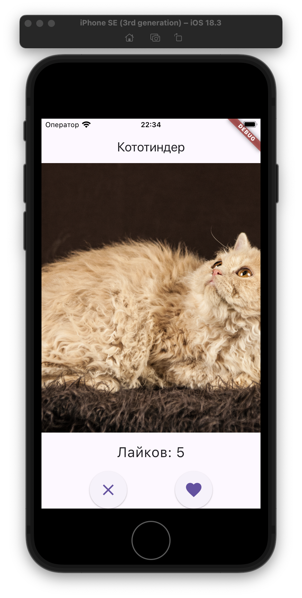
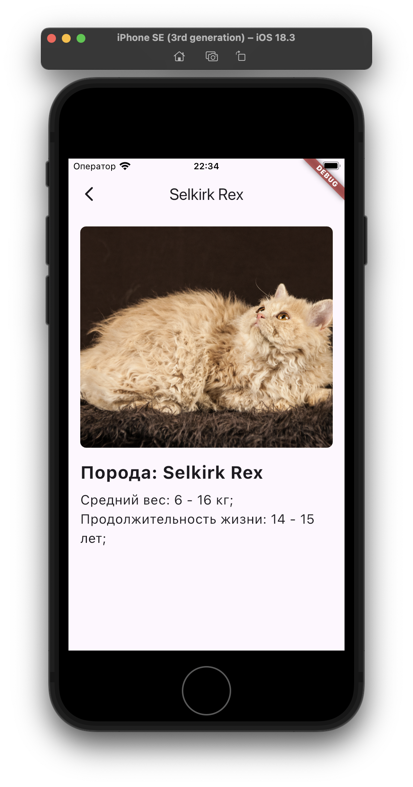

# Кототиндер

Кототиндер поможет найти Вам своего пушистого спутника по жизни, который будет радовать и портить Ваши обои каждый день.

> Найти такого красавца, как на скриншотах можно, скачав приложение по [ссылке](./app-release.apk).

## Реализованные фичи
- [x] На главном экране отображается случайное изображение котика и название его породы.
- [x] Изображение котика можно свайпнуть или смахнуть влево или вправо.
- [x] Есть две кнопки: лайк/дизлайк.
- [x] Смахивание, свайп или нажатие на кнопку должно сменять котика на нового.
- [x] Если котика лайкнули (лайк или свайп вправо), то на экране должен увеличиваться счетчик.
- [x] При нажатии на изображение котика открывается новый экран с детальным описанием.
- [x] На экране детального описания отображается то же изображение котика и вся информация про породу.

## Скриншоты

